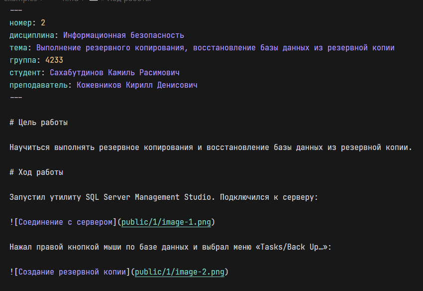
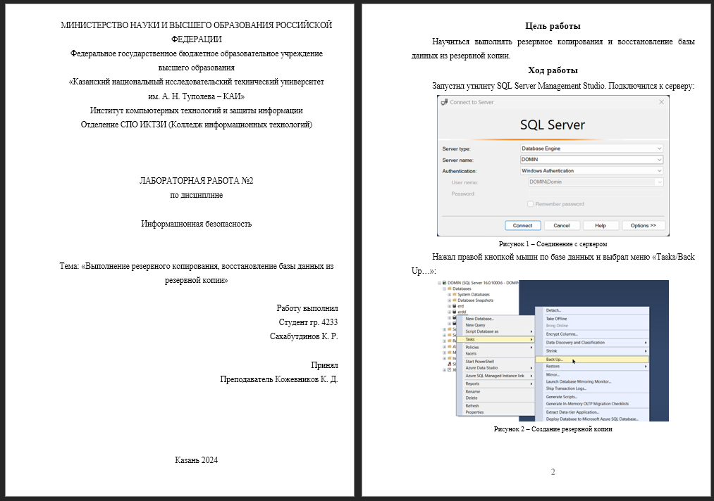
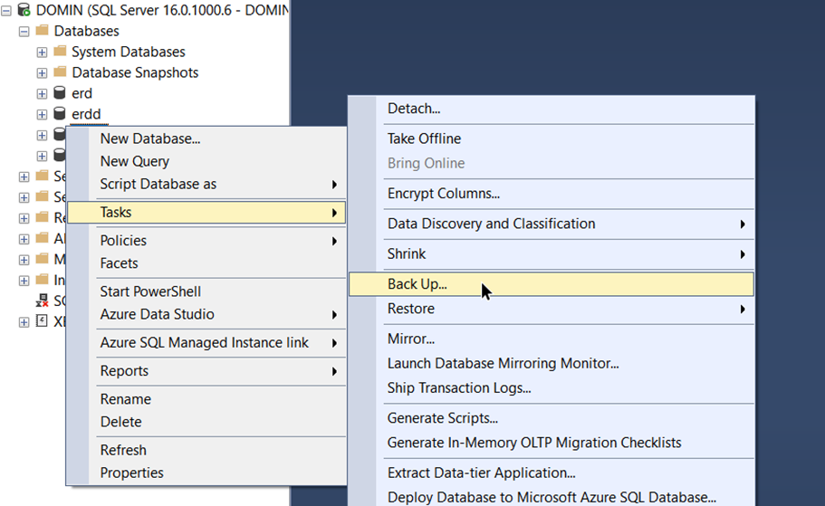

<p align="center">
  
</p>

| До                       | После                      |
| ------------------------ | -------------------------- |
|  |  |

# О проекте

Конвертация md файлов в отчёты по лабораторным работам КНИТУ-КАИ КИТ.

> [!CAUTION]
> Этот проект не предназначен для гибкой работы с любого рода лабораторными работами.

> [!WARNING]
> Если вы столкнулись с проблемой, пожалуйста, откройте issue!

# Установка

Установить исполняемый файл для Windows, Linux или macOS можно [через вкладку релизы](https://github.com/domin-mnd/knrtu-kai-docx/releases).

## Установка на компьютер КАИ

Для установки на компьютер КАИ используется Portable версия исполняемого файла. Она не имеет установщик. Найти сам исполняемый файл можно также [через вкладку релизы](https://github.com/domin-mnd/knrtu-kai-docx/releases) с названием `knrtu-kai-docx-portable.exe`.

## Установка на свой ноутбук/компьютер

Альтернативным вариантом установки программы может стать установщик [через ту же вкладку релизы](https://github.com/domin-mnd/knrtu-kai-docx/releases) с названием `knrtu-kai-docx-setup.exe`. Он установит программу в стандартную директорию для программ и создаст ярлык на рабочем столе.

# Использование

Markdown — облегчённый язык разметки, созданный с целью обозначения форматирования в простом тексте, с максимальным сохранением его читаемости человеком, и пригодный для машинного преобразования в языки для продвинутых публикаций (HTML, Rich Text и других).

> [Источник информации](https://ru.wikipedia.org/wiki/Markdown)

Т.е. этот проект конвертирует Markdown файлы в документы ворда.

Для создания отчёта необходимо указать несколько параметров.

Для этого рассмотрим пример:

```md
---
номер: 2
дисциплина: Информационная безопасность
тема: Выполнение резервного копирования, восстановление базы данных из резервной копии
группа: 4233
студент: Сахабутдинов Камиль Расимович
преподаватель: Кожевников Кирилл Денисович
---

# Цель работы

Научиться выполнять резервное копирования и восстановление базы данных из резервной копии.

# Ход работы

...
```

В этом примере заданы все необходимые параметры. Их названия соответствуют полям, которые используются в титульнике.

Можно заметить, что объект окружен разделителями - `---`. Эти разделители обязательны для определения параметров.

НО также эти разделители могут использоваться для перехода к следующей странице. Для этого рассмотрим пример синтаксиса языка:

```md
# Цель работы

Научиться выполнять [резервное копирования](https://www.youtube.com/watch?v=dQw4w9WgXcQ) и восстановление базы данных из резервной копии.

# Ход работы

Запустил утилиту `SQL Server Management Studio`. Подключился к серверу:


Нажал правой кнопкой мыши по базе данных и выбрал меню «Tasks/Back Up…»:



---

В разделе «Destination» указал путь и имя файла, в который будет выгружена база данных:
```

Здесь можно заметить несколько отделённых символами частей.

Символ `#` используется для указания заголовка. Строка заголовка всегда начинается с `#`, а текст после является содержанием заголовка.

Параграф (абзац) указывается обыкновенным текстом с новой строки.

Такие кавычки как \`текст\` показывают однострочный код, но для отчёта их использовать не советуется.

Изображение задаётся синтаксисом:

```md

```

Но стоит заметить, что также есть обыкновенные гиперссылки с похожим синтаксисом - `[подпись гиперссылки](ссылка на сайт)`. Их отличие в `!`, а также в том, что изображения желательно задавать с новой строки.

Затем можно увидеть один единственный разделитель - `---`. Разделитель без окружения переходит к следующей странице т.е. если страница документа ещё не заполнена, то разделитель всё равно создаст и перейдёт к следующей.

Также есть списки задаваемые синтаксисом:

```md
- Элемент списка без номеров
- Элемент 2
- Элемент 3
  - Элемент 1
  - Элемент 2
    - Элемент 1
- Элемент 4
```

Списки могут иметь вложенности как показано выше с "Элементом 1".

Таким же образом можно задать пронумерованные списки, а также комбинировать их:

```md
1. Элемент списка с номерами
2. Второй элемент
3. Третий элемент
4. Четвёртый элемент
   1. Вложенный элемент
   2. Второй вложенный элемент
      1. Ещё вложенный список
```

Или же комбинированный:

```md
1. Элемент списка с номерами
2. Второй элемент
3. Третий элемент
4. Четвёртый элемент
   - Вложенный элемент без номера
   - Второй вложенный элемент без номера
     1. Ещё вложенный список, но уже с номером
5. Пятый элемент
```

Также можно вставить код в этот же файл обернув его трёмя обратными кавычками - ```:

````
```
export function throwError(string: string) {
  console.error(string);
  process.exit(1);
}
```
````

Стоит учитывать, что неподдерживаемые проектом таблицы, html и цитаты просто не будут видны в конечном файле-документе.

> [!TIP]
> Больше примеров можно найти в директории `tests/examples`.

# License

Этот проект находится под лицензией [MIT](https://choosealicense.com/licenses/mit/). Вы можете свободно использовать его в своих целях.
