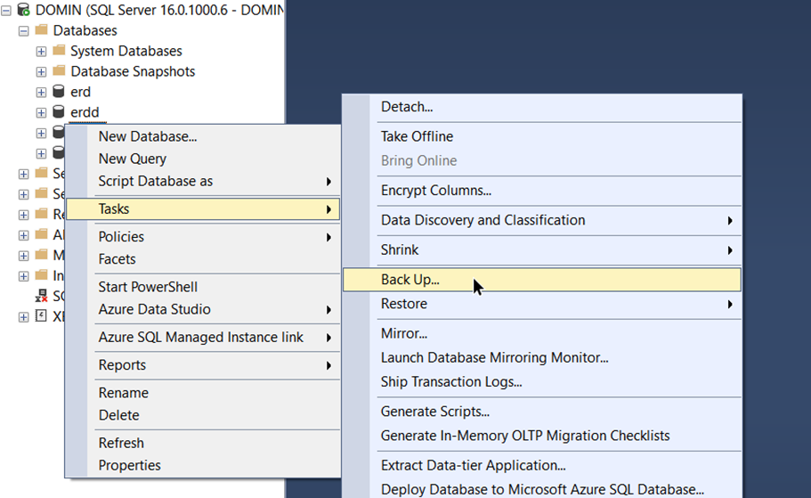
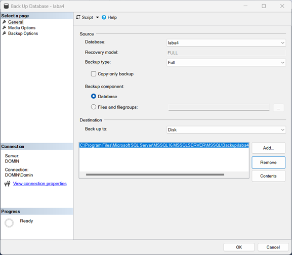
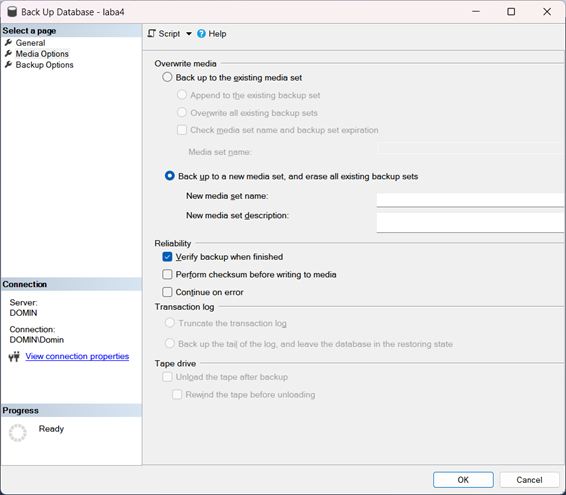
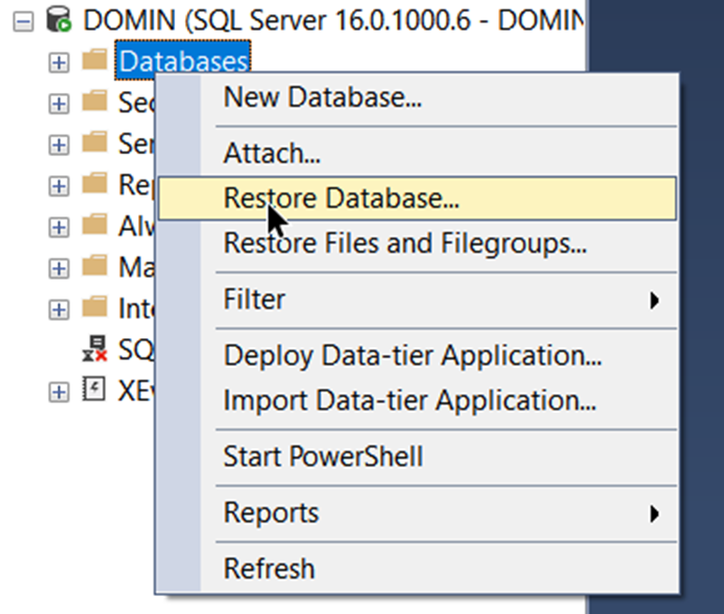
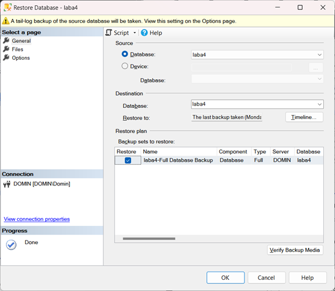
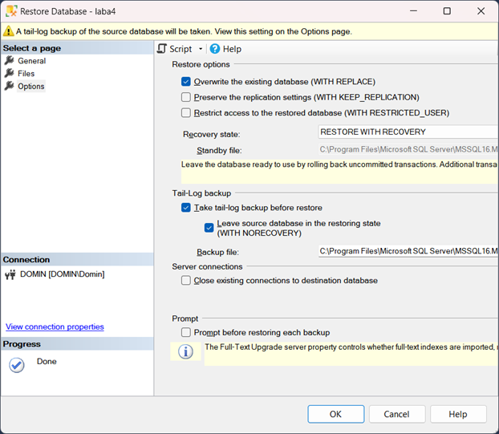

# Цель работы

Научиться выполнять резервное копирования и восстановление базы данных из резервной копии.

# Ход работы

Запустил утилиту SQL Server Management Studio. Подключился к серверу:

Нажал правой кнопкой мыши по базе данных и выбрал меню «Tasks/Back Up…»:

---

В разделе «Destination» указал путь и имя файла, в который будет выгружена база данных:

На странице «Media Options» установил переключатель «Back up to a new media set, and erase all existing backup sets» и галочку «Verify backup when finished»:

---

Для восстановления базы данных запустил утилиту SQL Server Management Studio. Подключился к серверу:

Нажал правой кнопкой мыши на раздел «Databases» и выбрал меню «Restore Database…»:

---

На странице «General»:

В поле «Database» ввёл имя для восстанавливаемой базы;

Установил галочку «Restore» в нужной строке:

На странице «Files» установил галочку «Overwrite the existing database (WITH REPLACE)»:

# Вывод

Научился выполнять резервное копирования и восстановление базы данных из резервной копии.
