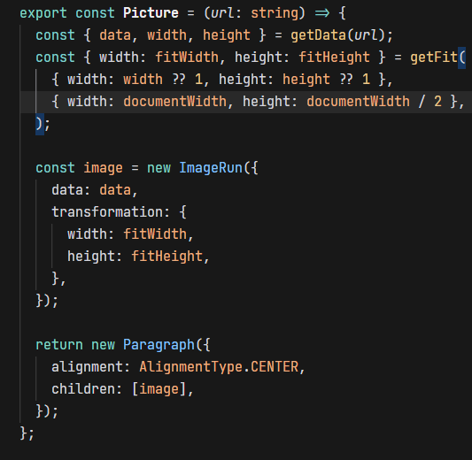

# Paragraph with links

Lorem ipsum dolor sit amet, consectetur adipiscing elit, sed do eiusmod tempor incididunt ut labore et dolore magna aliqua. Ut enim ad minim veniam, quis nostrud exercitation ullamco laboris nisi ut aliquip ex ea commodo consequat. Duis aute irure dolor in reprehenderit in voluptate velit esse cillum dolore eu fugiat [nulla](https://loremipsum.io/) pariatur. Excepteur sint occaecat cupidatat non proident, sunt in culpa qui officia deserunt mollit anim id est laborum.

## Unordered list

- List 1
- List 2
  - List 3
  - List 4
    - List 5
    - List 6
  - List 7
- List 8

## Ordered list

1. List 1
2. List 2
   1. List 3
   2. List 4
      1. List 5
      2. List 6
   3. List 7
3. List 8

## Combined list

- List 1
- List 2
  1. List 3
  2. List 4
     - List 5
     - List 6
  3. List 7
- List 8

## Separator with inline code

Lorem ipsum dolor sit amet, consectetur adipiscing elit, sed do eiusmod tempor incididunt ut labore et dolore magna aliqua. Ut enim ad minim veniam, quis nostrud exercitation ullamco `laboris` nisi ut aliquip ex ea commodo consequat. Duis aute irure dolor in reprehenderit in voluptate velit esse cillum dolore eu fugiat nulla pariatur. Excepteur sint occaecat `cupidatat` non proident, sunt in culpa qui `officia` deserunt mollit anim id est laborum.

---

Lorem `ipsum` dolor sit amet, consectetur adipiscing elit, `sed` do eiusmod tempor incididunt ut labore et dolore magna aliqua. Ut enim ad minim veniam, quis nostrud exercitation ullamco laboris nisi ut aliquip ex ea commodo consequat. Duis aute irure dolor in reprehenderit in voluptate velit esse cillum dolore eu `fugiat` nulla pariatur. `Excepteur` sint occaecat cupidatat non proident, sunt in culpa qui officia deserunt mollit anim id est laborum.

# Code

```ts
import {
  AlignmentType,
  type IParagraphOptions,
  Paragraph as DOCXParagraph,
  type ParagraphChild,
  convertInchesToTwip,
} from "docx";

export const Paragraph = (
  children: ParagraphChild[],
  options?: IParagraphOptions
) =>
  new DOCXParagraph({
    alignment: AlignmentType.JUSTIFIED,
    indent: {
      firstLine: "1.25cm",
    },
    spacing: {
      line: convertInchesToTwip(0.25),
    },
    children,
    ...options,
  });
```

```ts
console.log(Paragraph([]));
```

# Blockquote

> Lorem ipsum dolor sit amet, consectetur adipiscing elit, sed do eiusmod tempor incididunt ut labore et dolore magna aliqua. Ut enim ad minim veniam, quis nostrud exercitation ullamco laboris nisi ut aliquip ex ea commodo consequat. Duis aute irure dolor in reprehenderit in voluptate velit esse cillum dolore eu fugiat nulla pariatur. Excepteur sint occaecat cupidatat non proident, sunt in culpa qui officia deserunt mollit anim id est laborum.

# Image

Lorem ipsum dolor sit amet, consectetur adipiscing elit, sed do eiusmod tempor incididunt ut labore et dolore magna aliqua. Ut enim ad minim veniam, quis nostrud exercitation ullamco laboris nisi ut aliquip ex ea commodo consequat. Duis aute irure dolor in reprehenderit in voluptate velit esse cillum dolore eu fugiat nulla pariatur. Excepteur sint occaecat cupidatat non proident, sunt in culpa qui officia deserunt mollit anim id est laborum.


